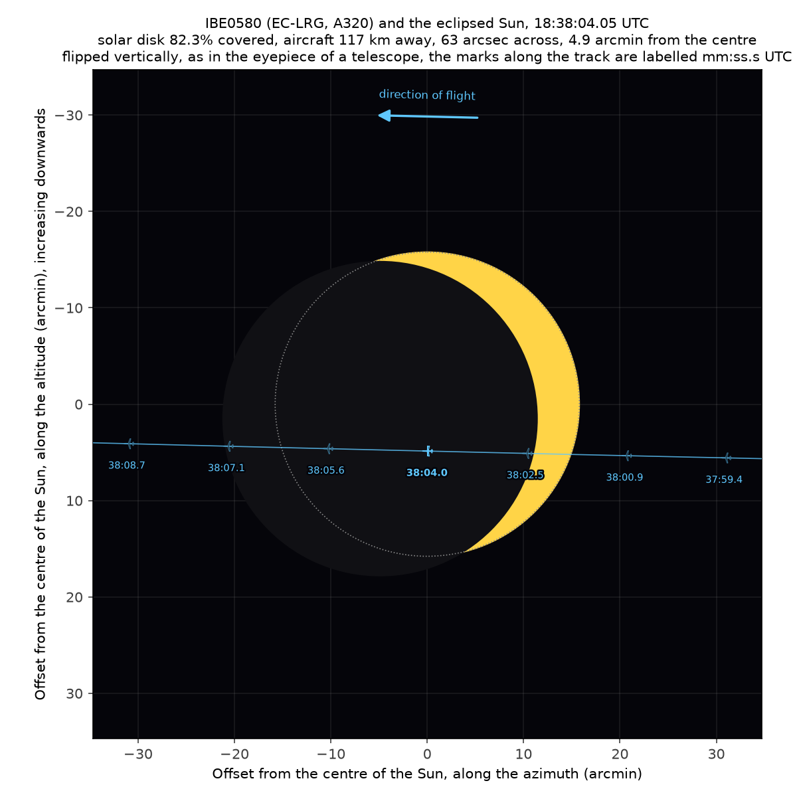

# AircraftSolarTransitFinder

Find the aircraft which crossed the apparent disk of the Sun, as seen from a given place at a
given time, using historical ADS-B data.

If you photographed the Sun and an aeroplane happened to fly across it, this tells you which
aeroplane it was: the callsign, the registration, the type, the flight level and the route. It was
written to identify aircraft seen in front of the eclipsed Sun during the total solar eclipse of
2026 August 12, but nothing in it is specific to an eclipse or to that date.



*The worked example below, drawn as it appears in the eyepiece of a telescope. The aircraft is
drawn to scale: 63 arcsec across, against a solar disk 31.6 arcmin wide.*

## What it does

1. Downloads historical ADS-B telemetry for the hours around the event and keeps only the reports
   inside a box around the site.
2. Interpolates every flight track to a fine time grid. The feed reports a position only about
   every 30 s, during which an airliner covers 7 km, so the interpolation is done with monotone
   cubic splines in ECEF coordinates, and its error is measured by leaving reports out.
3. Converts the position of every aircraft into apparent horizontal coordinates as seen from the
   site, including the refraction of a target at a finite distance.
4. Computes the apparent position of the Sun and of the Moon, the obscuration of the solar disk,
   and the angular separation between every aircraft and the centre of the Sun.
5. Ranks the candidates, estimates the uncertainty of every match, and plots the result.

## Two things which are easy to get wrong

Both are of the same size as the solar disk, so both are modelled explicitly.

**The altitude has to be measured from the geodetic horizon.** The geocentric and the geodetic
vertical differ by up to 0.19 deg at mid latitudes, which is more than the radius of the Sun. Get
this wrong and the answer is confidently the wrong aeroplane.

**An aircraft is refracted less than the Sun.** At an apparent elevation of 6 deg the light of the
Sun is bent by about 0.12 deg, while the light of an aircraft at 11 km, which is above most of the
refracting air, is bent by about 0.06 deg. The difference is a quarter of the solar diameter.
`SolarTransit/Refraction.py` traces rays through a standard atmosphere to get both consistently,
and reproduces Bennett's formula in the limit of an infinite distance.

## What limits the accuracy

The ADS-B feed reports only the barometric altitude, which is referenced to the standard pressure
and not to the real pressure field. The resulting uncertainty of a couple of hundred meters is
carried through the analysis rather than corrected, and at a distance of 100 km it dominates
everything else. The error budget reported for every candidate is:

| Term | Typical size at 100 km |
|---|---|
| Barometric versus geometric altitude, 250 m | 0.14 deg |
| Interpolation between ADS-B reports | 0.01 deg, measured per track |
| Residual of the refraction model | 0.015 deg |
| Site elevation, 30 m | 0.02 deg |
| ADS-B position quantisation, 100 m | 0.06 deg |

A candidate is only unambiguous if it is inside the disk and the runner up is outside the combined
error bars.

## Installation

```bash
conda create -n eclipse python=3.12 -y
conda activate eclipse
pip install -e .
```

This installs the `SolarTransit` package and the command line tools below.

## Quick start

One command does everything: it looks up the elevation of the site, downloads and caches the
ADS-B telemetry, searches the window, writes the ranked table and draws the plots.

```bash
solar-transit --lat 41.6488 --lon -0.8891 --time "2026-08-12 18:30:00" --window 12
```

| Option | Meaning |
|---|---|
| `--lat`, `--lon` | Coordinates of the site (deg, +north and +east), WGS84 |
| `--height` | Ground elevation of the site (m). Looked up in a digital elevation model if omitted |
| `--time` | Time of the event in UTC, `YYYY-MM-DD HH:MM:SS` |
| `--window` | Half width of the searched window in minutes. Use a wide one if the time is only known to the minute |
| `--sep` | Report everything which came closer than this to the centre of the Sun (deg) |
| `--view` | Orientation of the drawing: `flipped`, `naked_eye`, `mirrored` or `inverted` |
| `--nplot`, `--nprint`, `--noplots` | How much is plotted and printed |
| `--datadir`, `--resultsdir`, `--input` | Where the data are cached and the results are written |

Anything which is not given on the command line falls back to the configuration.

## Configuration

The data come from the [Contrails.org ADS-B API](https://apidocs.contrails.org/notebooks/adsb_api.html),
which serves Spire Aviation telemetry. The key is never stored in the repository. Provide it in the
environment:

```bash
export CONTRAILS_API_KEY=your_key_here
```

or in the file `~/.config/solar_transit/api_key`.

The observing site and the time of the event go into a `config.json` in the root of the repository,
which is not tracked by git. Copy `config.example.json` and edit it:

```json
{
    "site_lat": 41.6488,
    "site_lon": -0.8891,
    "nominal_time": "2026-08-12 18:30:00",
    "search_half_window_minutes": 8
}
```

Anything which is not in `config.json` falls back to the defaults in `SolarTransit/Config.py`.
If `site_ground_elevation` is not given, it is looked up in a digital elevation model.

## The steps on their own

Every step of the pipeline is also a command of its own, which is useful when only a part of the
work has to be repeated. They all read the configuration, and each one is a module of the package,
so `python -m SolarTransit.TransitSearch` does the same as `solar-transit-search`.

```bash
# Look up the ground elevation of a site in a digital elevation model, and cache it
solar-transit-elevation --lat 41.6488 --lon -0.8891

# Print the position of the Sun and the circumstances of the eclipse at the site
solar-transit-ephemeris

# Download the telemetry and write the regional subset, without searching
solar-transit-fetch

# Search an already downloaded subset
solar-transit-search -w 12

# Plot the best candidates of an earlier search, or specific ones by callsign
solar-transit-plot -n 3
solar-transit-plot IBE0580 --view naked_eye
```

The search writes `results/candidates.csv` with a row per candidate, and the plots write a view of
the Sun per candidate, the angular separation against time, and a map of the ground tracks.

## Use as a library

```python
import datetime
from SolarTransit import ObservingSite, runPipeline

site = ObservingSite(41.6488, -0.8891)

results = runPipeline(site, datetime.datetime(2026, 8, 12, 18, 30),
    half_window=datetime.timedelta(minutes=12))

best = results['candidates'][0]

print(best['callsign'], best['tail_number'], best['min_sep_deg'])
```

`runSearch` gives the candidates without writing anything, and `plotCandidates` draws a table of
candidates which is already in memory. The lower level pieces, such as `RefractionTable`,
`buildTracks` and `eclipseCircumstances`, are exported as well.

## Tests

```bash
python -m unittest discover -s Tests -p "Test*.py" -v
```

Or a single file, e.g. `python Tests/TestGeometry.py`. The geometry is checked against PROJ, the
refraction against Bennett's formula, and the ephemeris against an independent low precision
solar position algorithm at several sites and times.

## Worked example

The defaults search for aircraft in front of the Sun during the total solar eclipse of
2026 August 12, seen from Zaragoza in Spain (41.6488 N, 0.8891 W, 227 m above sea level, inside the
path of totality). Totality there ran from 18:28:55 to 18:30:20 UTC.

```
$ solar-transit --lat 41.6488 --lon -0.8891 --time "2026-08-12 18:30:00" --window 12

Found 9 aircraft within 2.00 deg of the centre of the Sun
The Sun at 2026-08-12 18:30:00 UTC: altitude 5.86 deg, azimuth 284.60 deg
    the solar disk was 100.0% covered by the Moon

Rank Callsign  Reg      Type   Time (UTC)   Sep (deg)      +/-      FL  Dist km   Gap s   Disk
--------------------------------------------------------------------------------------------
1    IBE0580   EC-LRG   A320   18:38:04.100    0.0812   0.1339     350    116.8    29.0    yes
2    RYR64GA   EI-DPK   B738   18:39:34.800    0.1736   0.1234     370    126.9    19.0    yes
3    IBE06CC   EC-ILS   A320   18:38:06.400    0.2636   0.1572     305     99.5    28.0     no
4    RYR13CC   EI-DYO   B738   18:41:57.100    0.4289   0.1199     370    130.6    29.0     no
5    RAM771T   CN-RHC   B38M   18:35:40.000    0.6808   0.1197     370    131.0    30.0     no

The best candidate crossed the disk of the Sun:
    IBE0580 (EC-LRG, A320) at 18:38:04.10 UTC
    0.0812 +/- 0.1339 deg from the centre of the Sun, whose radius was 0.2630 deg
    flight level 350, 117 km away, LFPG to LEMD
```

The first of them, Iberia 580 from Paris to Madrid, crossed the disk of the Sun at 18:38:04 UTC,
117 km away at flight level 350, when the Sun was 82% covered and 4.4 deg above the horizon. That
is the transit in the figure at the top.

## Repository layout

```
SolarTransit/
    Pipeline.py       the whole analysis in one call, and the solar-transit command
    Config.py         defaults, the local config.json and the API access
    Site.py           the observing site, its elevation, its ECEF position and its box
    SiteElevation.py  elevation of a site from a digital elevation model, with a cache
    ADSBData.py       download, cache and regional subset of the telemetry
    Conversions.py    geodetic and horizontal coordinate conversions
    Refraction.py     ray tracing of the refraction through a standard atmosphere
    Ephemeris.py      apparent Sun and Moon, obscuration of the solar disk
    Trajectory.py     interpolation of the tracks and its error
    TransitSearch.py  the search itself, the ranking and the error budget
    PlotTransits.py   the view of the Sun, the separation and the map
Tests/
    TestGeometry.py   geometry, refraction, ephemeris and interpolation
    TestPipeline.py   the site, the elevation cache and the command line interface
```

## Data source

`https://api.contrails.org/v1/adsb/telemetry?date=YYYY-MM-DDTHH` with the key in the `x-api-key`
header returns one hour of global ADS-B telemetry as an Apache Parquet file of about 60 MB. The
underlying data are from Spire Aviation.

## Credits

The geodetic conversions in `SolarTransit/Conversions.py` come from the
[RMS](https://github.com/CroatianMeteorNetwork/RMS) meteor station library, with the altitude
changed from the geocentric to the geodetic horizon.

Released under the MIT licence.
